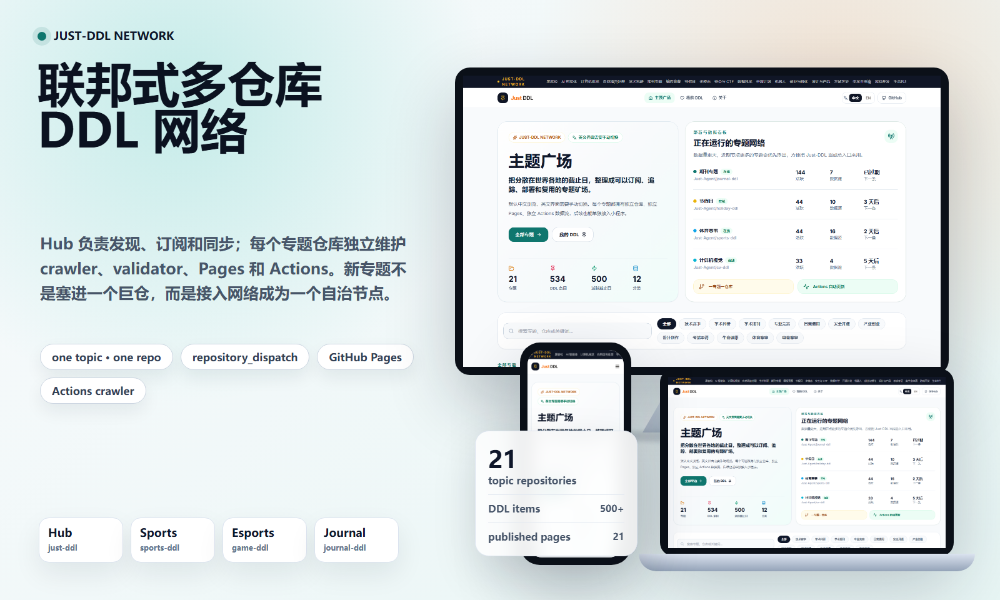
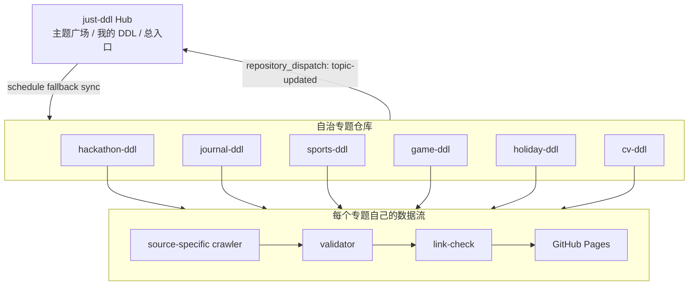
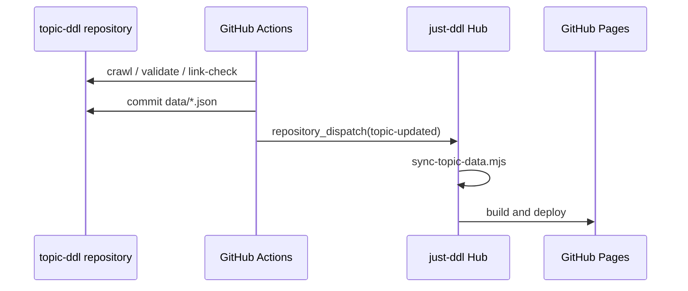

<p align="center">
  
</p>

<h1 align="center">Just-DDL</h1>

<p align="center">
  一个联邦式多仓库 DDL 网络。Hub 负责发现、订阅和同步；每个专题仓库独立维护 crawler、validator、GitHub Pages 和 Actions。
</p>

<p align="center">
  <a href="https://just-agent.github.io/just-ddl/"></a>
  <a href="https://github.com/Just-Agent"></a>
  <a href="https://react.dev/"></a>
  <a href="https://vite.dev/"></a>
</p>

<p align="center">
  <a href="https://just-agent.github.io/just-ddl/"><strong>打开主题广场</strong></a>
  ·
  <a href="https://github.com/Just-Agent">GitHub 组织</a>
  ·
  <a href="https://just-agent.github.io/just-ddl/#/topic/sports-ddl">体育赛事</a>
  ·
  <a href="https://just-agent.github.io/just-ddl/#/topic/game-ddl">电竞赛事</a>
  ·
  <a href="https://just-agent.github.io/just-ddl/#/topic/journal-ddl">期刊专题</a>
</p>

## 核心定位

Just-DDL 不是把所有截止日、所有爬虫、所有页面都塞进一个巨型仓库的 monorepo。它更像一个 **联邦式多仓库网络**：

- `just-ddl` 是 Hub：负责主题广场、我的 DDL、专题发现、订阅入口和总导航。
- 每个 `*-ddl` 是自治专题节点：自己拥有数据、README、Pages、crawler、validator、link-check 和 Actions。
- 子专题更新后用 `repository_dispatch` 主动通知 Hub 同步。
- Hub 定时兜底同步，保证某个专题临时失败也不会拖垮整个网络。

这个设计很适合 DDL 场景：黑客松、学术会议、期刊 CFP、体育赛事、电竞赛事、节假日的来源结构完全不同，拆成自治仓库后，每个专题可以按自己的节奏迭代。

## 网络规模

| 指标 | 当前值 |
| --- | ---: |
| 专题仓库 | 21 |
| GitHub Pages 专题站 | 21 |
| DDL 条目 | 534 |
| 数据入口 | `src/data/ddl-data.ts` + 各专题 `data/items.json` |
| 默认语言 | 中文 |
| 后续入口 | 微信小程序版本即将上线，敬请期待 |

## 联邦架构



## 为什么这个方式巧妙

| 问题 | 单仓库做法 | Just-DDL 联邦做法 |
| --- | --- | --- |
| 数据源差异巨大 | 一个 workflow 里塞很多爬虫，容易互相影响 | 每个专题有自己的 Actions 和失败边界 |
| 页面风格不同 | 所有专题被迫共享一种页面 | 每个专题可以有独立 Pages 和 README 风格 |
| 新专题扩展 | 改主仓库、改总 workflow、风险集中 | 新建一个专题仓库，再注册到 Hub |
| 定时更新 | 一个 schedule 越跑越复杂 | 每个专题按自己的频率更新，成功后通知 Hub |
| 小程序复用 | 数据结构混在一起 | 每个专题都能输出标准 `data/items.json` |
| 生产稳定性 | 一个专题坏了可能影响全站 | 单个节点坏了，Hub 和其他节点继续运行 |

## 专题节点

| 专题 | 仓库 | Pages | 数据流 |
| --- | --- | --- | --- |
| 黑客松 | [hackathon-ddl](https://github.com/Just-Agent/hackathon-ddl) | [访问](https://just-agent.github.io/hackathon-ddl/) | 独立 Actions |
| AI 智能体 | [agent-ddl](https://github.com/Just-Agent/agent-ddl) | [访问](https://just-agent.github.io/agent-ddl/) | 独立 Actions |
| 计算机视觉 | [cv-ddl](https://github.com/Just-Agent/cv-ddl) | [访问](https://just-agent.github.io/cv-ddl/) | 独立 Actions |
| NLP | [nlp-ddl](https://github.com/Just-Agent/nlp-ddl) | [访问](https://just-agent.github.io/nlp-ddl/) | 独立 Actions |
| 学术科研 | [academic-ddl](https://github.com/Just-Agent/academic-ddl) | [访问](https://just-agent.github.io/academic-ddl/) | 独立 Actions |
| 期刊专题 | [journal-ddl](https://github.com/Just-Agent/journal-ddl) | [访问](https://just-agent.github.io/journal-ddl/) | crawler + validator + link-check |
| 编程竞赛 | [programming-ddl](https://github.com/Just-Agent/programming-ddl) | [访问](https://just-agent.github.io/programming-ddl/) | 独立 Actions |
| 节假日 | [holiday-ddl](https://github.com/Just-Agent/holiday-ddl) | [访问](https://just-agent.github.io/holiday-ddl/) | 独立 Actions |
| 体育赛事 | [sports-ddl](https://github.com/Just-Agent/sports-ddl) | [访问](https://just-agent.github.io/sports-ddl/) | crawler + validator + link-check |
| 电竞赛事 | [game-ddl](https://github.com/Just-Agent/game-ddl) | [访问](https://just-agent.github.io/game-ddl/) | crawler + validator + link-check |

完整专题列表请在 [主题广场](https://just-agent.github.io/just-ddl/) 查看。

## 数据契约

每个专题仓库都尽量保持同一套公开数据契约：

```text
topic-ddl/
├─ data/
│  ├─ items.json          # DDL 条目
│  ├─ sources.json        # 官方/主办方/权威聚合来源
│  └─ crawl-report.json   # 最近一次 crawler 检查结果
├─ scripts/
│  ├─ crawl-sources.mjs
│  ├─ validate-data.mjs
│  └─ link-check.mjs
└─ .github/workflows/
   ├─ deploy-pages.yml
   └─ update-data.yml
```

核心字段：

| 字段 | 说明 |
| --- | --- |
| `id` | 全网唯一 DDL 条目 ID |
| `title` | 事件名称 |
| `deadline` | ISO 时间，用于倒计时 |
| `dateRange` | 用户可读日期窗口 |
| `url` / `sourceUrl` | 官方或来源页面 |
| `subtopic` / `subtopicName` | 子专题，用于折叠、Pin、分类展示 |
| `source` | 来源名 |
| `stage` | 开赛、投稿、报名、资格赛、决赛等阶段 |

## 更新机制



`repository_dispatch` 是 GitHub 官方事件机制。它让一个专题仓库在数据更新成功后，主动提醒 Hub 立刻同步，而不是等下一个定时任务。

## 本地开发

```bash
npm install
npm run dev
```

生产发布以 GitHub Actions 和 GitHub Pages 为准。

```bash
npm run build
```

## 新专题如何加入网络

新增专题推荐走这个流程：

1. 先在 Hub 提 Proposal，说明专题名、数据源、更新频率、是否需要子专题。
2. 使用统一模板创建独立仓库，例如 `robotics-ddl`、`sports-ddl`、`game-ddl`。
3. 在专题仓库补齐 `README.md`、`index.html`、`data/items.json`、`data/sources.json`。
4. 增加 `crawler`、`validator`、`link-check` 和 Node 24 Actions。
5. 在 Hub 注册专题元数据。
6. 专题更新成功后用 `repository_dispatch` 通知 Hub 同步。

## 缩略图

README 顶部缩略图由本地 `just-thumbnail` 工作流生成：先抓取线上 Hub 的桌面、平板、手机截图，再合成为联邦网络预览图。生成资产保存在：

```text
docs/assets/readme/federated-network.png
```

## License

当前仓库处于产品孵化阶段。正式开源协议会在发布稳定版本前补齐。
