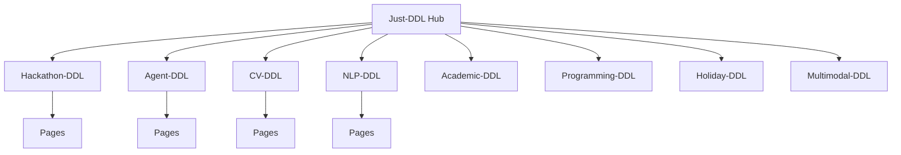

<div align="center">

# Just-DDL

一个面向学生、开发者、科研人员的 DDL 专题网络。

每个专题一个独立 GitHub 仓库，每个仓库一套独立 Actions 和 GitHub Pages，主仓库负责统一发现、订阅和导航。

[](https://just-agent.github.io/just-ddl/)
[](https://github.com/Just-Agent)
[](https://react.dev/)
[](https://vite.dev/)

[在线访问](https://just-agent.github.io/just-ddl/) · [Hackathon-DDL](https://just-agent.github.io/hackathon-ddl/) · [Agent-DDL](https://just-agent.github.io/agent-ddl/) · [GitHub 组织](https://github.com/Just-Agent)

</div>

## 项目定位

Just-DDL 是所有 DDL 专题的总入口。它不把所有抓取逻辑、页面逻辑和发布逻辑塞在一个仓库里，而是采用“一专题一仓库”的方式：专题仓库负责自己的数据与页面，Just-DDL 负责汇总、导航、订阅和未来多端产品入口。

## 为什么拆成多个仓库

| 原因 | 价值 |
| --- | --- |
| 独立 Actions | 黑客松、Agent、CV、节假日的数据源完全不同，独立 workflow 更稳 |
| 独立 Pages | 每个专题可以有自己的展示风格和发布节奏 |
| 独立维护 | 某个专题出错不影响其他专题上线 |
| 方便扩展 | 新专题只需要新仓库，再在 hub 注册 |
| 适合小程序 | 未来微信小程序可以按专题复用同一份数据模型 |

## 网络结构



## 专题仓库

| 专题 | GitHub 仓库 | GitHub Pages | 当前阶段 |
| --- | --- | --- | --- |
| Hackathon-DDL | [Just-Agent/hackathon-ddl](https://github.com/Just-Agent/hackathon-ddl) | [访问](https://just-agent.github.io/hackathon-ddl/) | 已发布 |
| Agent-DDL | [Just-Agent/agent-ddl](https://github.com/Just-Agent/agent-ddl) | [访问](https://just-agent.github.io/agent-ddl/) | 已发布 |
| CV-DDL | [Just-Agent/cv-ddl](https://github.com/Just-Agent/cv-ddl) | [访问](https://just-agent.github.io/cv-ddl/) | 专题骨架 |
| NLP-DDL | [Just-Agent/nlp-ddl](https://github.com/Just-Agent/nlp-ddl) | [访问](https://just-agent.github.io/nlp-ddl/) | 专题骨架 |
| Academic-DDL | [Just-Agent/academic-ddl](https://github.com/Just-Agent/academic-ddl) | [访问](https://just-agent.github.io/academic-ddl/) | 专题骨架 |
| Programming-DDL | [Just-Agent/programming-ddl](https://github.com/Just-Agent/programming-ddl) | [访问](https://just-agent.github.io/programming-ddl/) | 专题骨架 |
| Holiday-DDL | [Just-Agent/holiday-ddl](https://github.com/Just-Agent/holiday-ddl) | [访问](https://just-agent.github.io/holiday-ddl/) | 专题骨架 |
| Multimodal-DDL | [Just-Agent/multimodal-ddl](https://github.com/Just-Agent/multimodal-ddl) | [访问](https://just-agent.github.io/multimodal-ddl/) | 专题骨架 |

## Hub 能力

| 模块 | 当前能力 | 后续方向 |
| --- | --- | --- |
| 专题广场 | 展示全部 DDL 专题、分类、标签、仓库入口 | 增加专题健康状态和更新时间 |
| 专题详情 | 展示专题内 DDL 列表、订阅按钮、GitHub 链接、Pages 直达 | 增加数据源说明和更新时间 |
| 我的 DDL | 本地订阅专题与单个 DDL | 与 PC / App 私有 DDL 合并 |
| 多端计划 | Web 先行，预留小程序和移动端 | 统一数据 schema 和 API |

## 部署模型

| 层级 | 仓库 | 部署方式 |
| --- | --- | --- |
| 总入口 | `just-ddl` | React + Vite + GitHub Pages |
| 已上线专题 | `hackathon-ddl`, `agent-ddl` | React + Vite + GitHub Pages |
| 待扩展专题 | `cv-ddl`, `nlp-ddl`, `academic-ddl`, `programming-ddl`, `holiday-ddl`, `multimodal-ddl` | 先发布统一静态 Pages 骨架，再逐步接入专题数据与 Actions |

> 本项目约定生产构建、打包和 Pages 发布全部由 GitHub Actions 完成。本地没有生产环境时，不在本地强行构建。

## 本地开发

```bash
npm install
npm run dev
```

本地开发只用于页面预览。生产机部署是否完成，以 GitHub Actions 和 GitHub Pages 状态为准。

## 路线图

| 阶段 | 事项 | 状态 |
| --- | --- | --- |
| 1 | 建立 Just-Agent 组织下的专题仓库矩阵 | 完成 |
| 2 | 发布 Hackathon、Agent、Just-DDL 三个 Pages | 完成 |
| 3 | 为所有规划专题补齐 README 和 Pages 骨架 | 进行中 |
| 4 | 为每个专题建立独立数据抓取 workflow | 计划中 |
| 5 | 接入微信小程序专题页 | 计划中 |
| 6 | PC / App 支持个人 DDL、本地加密和多端同步 | 计划中 |

## 贡献

新专题建议先在 Just-DDL Hub 提 Issue，说明专题名、数据来源、更新频率、是否需要独立 Actions、是否需要小程序入口。确认后再创建独立仓库并加入专题表。

## License

当前仓库处于产品孵化阶段。正式开源协议会在发布稳定版本前补齐。
