<p align="center">
  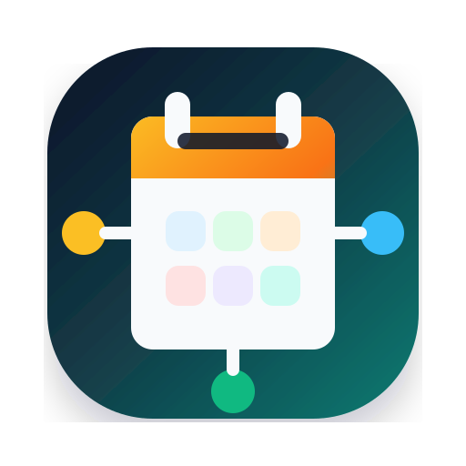
</p>

<h1 align="center">Just-DDL</h1>

<p align="center">
  一个面向竞赛、科研、期刊、节假日和个人规划的 <strong>联邦式多仓库 DDL 网络</strong>。
  <br>
  Hub 负责发现、订阅和同步；每个专题仓库独立维护 crawler、validator、GitHub Pages 和 Actions。
</p>

<p align="center">
  <a href="https://just-agent.github.io/just-ddl/"></a>
  <a href="https://github.com/Just-Agent"></a>
  <a href="https://react.dev/"></a>
  <a href="https://vite.dev/"></a>
</p>

<p align="center">
  <a href="https://just-agent.github.io/just-ddl/"><strong>打开主题广场</strong></a>
  ·
  <a href="https://just-agent.github.io/just-ddl/#/contribute"><strong>接入你的专题</strong></a>
  ·
  <a href="https://github.com/Just-Agent">GitHub 组织</a>
  ·
  <a href="https://just-agent.github.io/just-ddl/#/topic/sports-ddl">体育赛事</a>
  ·
  <a href="https://just-agent.github.io/just-ddl/#/topic/game-ddl">电竞赛事</a>
  ·
  <a href="https://just-agent.github.io/just-ddl/#/topic/journal-ddl">期刊专题</a>
</p>

<p align="center">
  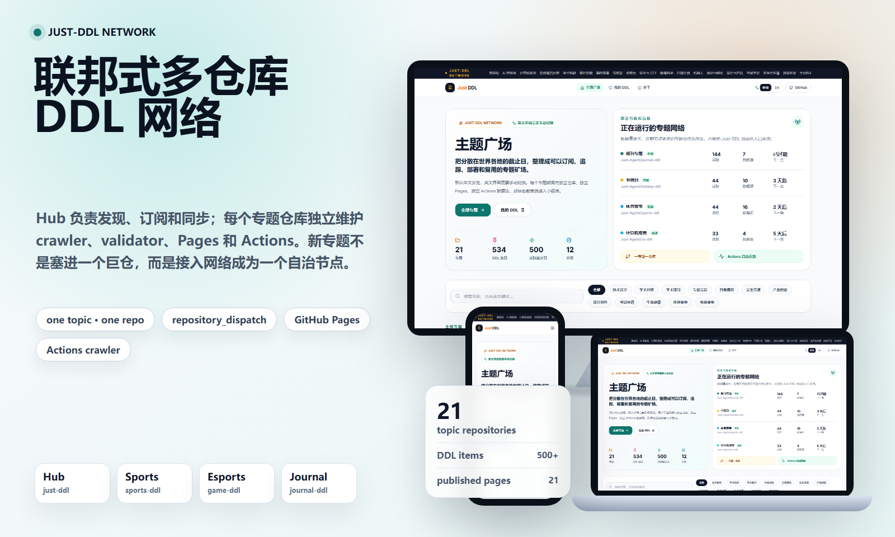
</p>

## 核心定位

Just-DDL 不是把所有截止日、所有爬虫、所有页面都塞进一个巨型仓库的 monorepo。它更像一个 **联邦式多仓库网络**：

- `just-ddl` 是 Hub：负责主题广场、我的 DDL、专题发现、订阅入口和总导航。
- 每个 `*-ddl` 是自治专题节点：自己拥有数据、README、Pages、crawler、validator、link-check 和 Actions。
- 子专题更新后用 `repository_dispatch` 主动通知 Hub 同步。
- Hub 定时兜底同步，保证某个专题临时失败也不会拖垮整个网络。

这个设计很适合 DDL 场景：黑客松、学术会议、期刊 CFP、体育赛事、电竞赛事、节假日的来源结构完全不同，拆成自治仓库后，每个专题可以按自己的节奏迭代。

## 网络规模

| 指标 | 当前值 |
| --- | ---: |
| 专题仓库 | 21 |
| GitHub Pages 专题站 | 21 |
| DDL 条目 | 534 |
| 数据入口 | `src/data/ddl-data.ts` + 各专题 `data/items.json` |
| 默认语言 | 中文 |
| 后续入口 | 微信小程序版本即将上线，敬请期待 |

## 适合谁

| 角色 | 可以用 Just-DDL 做什么 |
| --- | --- |
| 学生 / 参赛者 | 收藏黑客松、算法竞赛、电竞赛事、考试考证和奖学金申请截止日 |
| 科研人员 | 跟踪学术会议、CV/NLP/多模态挑战、期刊 Special Issue 与 CFP |
| 专题维护者 | 独立维护一个 `*-ddl` 仓库，按自己的来源、频率和 Actions 更新 |
| 产品侧 | 把 Hub 数据出口复用到 Web、微信小程序和后续 App，不重复写爬虫 |

## 联邦架构

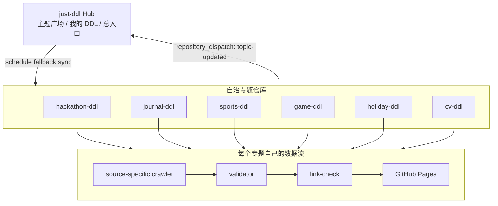
```mermaid
flowchart TB
  Hub["just-ddl Hub<br/>主题广场 / 我的 DDL / 总入口"]

  subgraph Topics["自治专题仓库"]
    Hackathon["hackathon-ddl"]
    Journal["journal-ddl"]
    Sports["sports-ddl"]
    Game["game-ddl"]
    Holiday["holiday-ddl"]
    CV["cv-ddl"]
  end

  subgraph Pipeline["每个专题自己的数据流"]
    Crawler["source-specific crawler"]
    Validator["validator"]
    LinkCheck["link-check"]
    Pages["GitHub Pages"]
  end

  Crawler --> Validator --> LinkCheck --> Pages
  Hackathon --> Pipeline
  Journal --> Pipeline
  Sports --> Pipeline
  Game --> Pipeline
  Holiday --> Pipeline
  CV --> Pipeline

  Topics -- "repository_dispatch: topic-updated" --> Hub
  Hub -- "schedule fallback sync" --> Topics
```

## 为什么这个方式巧妙

| 问题 | 单仓库做法 | Just-DDL 联邦做法 |
| --- | --- | --- |
| 数据源差异巨大 | 一个 workflow 里塞很多爬虫，容易互相影响 | 每个专题有自己的 Actions 和失败边界 |
| 页面风格不同 | 所有专题被迫共享一种页面 | 每个专题可以有独立 Pages 和 README 风格 |
| 新专题扩展 | 改主仓库、改总 workflow、风险集中 | 新建一个专题仓库，再注册到 Hub |
| 定时更新 | 一个 schedule 越跑越复杂 | 每个专题按自己的频率更新，成功后通知 Hub |
| 小程序复用 | 数据结构混在一起 | 每个专题都能输出标准 `data/items.json` |
| 生产稳定性 | 一个专题坏了可能影响全站 | 单个节点坏了，Hub 和其他节点继续运行 |

## 专题节点

| 专题 | 仓库 | Pages | 数据流 |
| --- | --- | --- | --- |
| 黑客松 | [hackathon-ddl](https://github.com/Just-Agent/hackathon-ddl) | [访问](https://just-agent.github.io/hackathon-ddl/) | 独立 Actions |
| AI 智能体 | [agent-ddl](https://github.com/Just-Agent/agent-ddl) | [访问](https://just-agent.github.io/agent-ddl/) | 独立 Actions |
| 计算机视觉 | [cv-ddl](https://github.com/Just-Agent/cv-ddl) | [访问](https://just-agent.github.io/cv-ddl/) | 独立 Actions |
| NLP | [nlp-ddl](https://github.com/Just-Agent/nlp-ddl) | [访问](https://just-agent.github.io/nlp-ddl/) | 独立 Actions |
| 学术科研 | [academic-ddl](https://github.com/Just-Agent/academic-ddl) | [访问](https://just-agent.github.io/academic-ddl/) | 独立 Actions |
| 期刊专题 | [journal-ddl](https://github.com/Just-Agent/journal-ddl) | [访问](https://just-agent.github.io/journal-ddl/) | crawler + validator + link-check |
| 编程竞赛 | [programming-ddl](https://github.com/Just-Agent/programming-ddl) | [访问](https://just-agent.github.io/programming-ddl/) | 独立 Actions |
| 节假日 | [holiday-ddl](https://github.com/Just-Agent/holiday-ddl) | [访问](https://just-agent.github.io/holiday-ddl/) | 独立 Actions |
| 考公考编 | [civil-service-ddl](https://github.com/pengpoom/civil-service-ddl) | [访问](https://pengpoom.github.io/civil-service-ddl/) | 外部联邦专题 + 定时更新 |
| 体育赛事 | [sports-ddl](https://github.com/Just-Agent/sports-ddl) | [访问](https://just-agent.github.io/sports-ddl/) | crawler + validator + link-check |
| 电竞赛事 | [game-ddl](https://github.com/Just-Agent/game-ddl) | [访问](https://just-agent.github.io/game-ddl/) | crawler + validator + link-check |

完整专题列表请在 [主题广场](https://just-agent.github.io/just-ddl/) 查看。

## 数据契约

每个专题仓库都尽量保持同一套公开数据契约：

```text
topic-ddl/
├─ data/
│  ├─ items.json          # DDL 条目
│  ├─ sources.json        # 官方/主办方/权威聚合来源
│  └─ crawl-report.json   # 最近一次 crawler 检查结果
├─ scripts/
│  ├─ crawl-sources.mjs
│  ├─ validate-data.mjs
│  └─ link-check.mjs
└─ .github/workflows/
   ├─ deploy-pages.yml
   └─ update-data.yml
```

核心字段：

| 字段 | 说明 |
| --- | --- |
| `id` | 全网唯一 DDL 条目 ID |
| `title` | 事件名称 |
| `deadline` | ISO 时间，用于倒计时 |
| `dateRange` | 用户可读日期窗口 |
| `url` / `sourceUrl` | 官方或来源页面 |
| `subtopic` / `subtopicName` | 子专题，用于折叠、Pin、分类展示 |
| `source` | 来源名 |
| `stage` | 开赛、投稿、报名、资格赛、决赛等阶段 |

## 更新机制

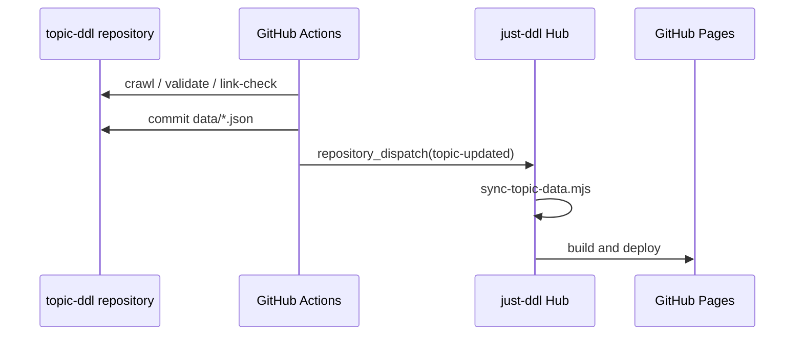
```mermaid
sequenceDiagram
  participant Topic as topic-ddl repository
  participant Action as GitHub Actions
  participant Hub as just-ddl Hub
  participant Pages as GitHub Pages

  Action->>Topic: crawl / validate / link-check
  Action->>Topic: commit data/*.json
  Action->>Hub: repository_dispatch(topic-updated)
  Hub->>Hub: sync-topic-data.mjs
  Hub->>Pages: build and deploy
```

`repository_dispatch` 是 GitHub 官方事件机制。它让一个专题仓库在数据更新成功后，主动提醒 Hub 立刻同步，而不是等下一个定时任务。

## 本地开发

```bash
npm install
npm run dev
```

生产发布以 GitHub Actions 和 GitHub Pages 为准。

```bash
npm run build
```

## 新专题如何加入网络

> 如果你要新增一个 DDL 专题，请先创建独立 `xxx-ddl` 仓库并发布 GitHub Pages，再向 `Just-Agent/just-ddl` 提交 PR 注册专题。Just-DDL Hub 不直接托管所有专题数据，而是接入各专题仓库的标准数据出口。

先记住一个原则：**新增专题默认走外部联邦节点**。朋友或团队先在自己的账号维护 `friend/xxx-ddl`，Hub 只接入它的 Pages / JSON；等专题长期稳定、质量可靠、确实适合作为核心专题时，再考虑转移到 `Just-Agent` 组织做官方托管。

| 你想做什么 | 应该 PR 哪个仓库 | 说明 |
| --- | --- | --- |
| 改 Hub 首页、主题广场、我的 DDL、小程序数据出口 | `Just-Agent/just-ddl` | 这是总入口和聚合层 |
| 改已有专题的数据或页面 | 对应专题仓库 | 例如 `sports-ddl`、`game-ddl`、`journal-ddl` |
| 新增完整专题 | 先建自己的 `xxx-ddl`，再 PR `Just-Agent/just-ddl` | PR 里提交注册信息，不要把大量专题数据直接塞进 Hub |
| 改微信小程序 | `Just-Agent/just-ddl-miniprogram` | 小程序是独立仓库 |

新增专题的最小接入流程：

1. 在自己的 GitHub 账号下创建公开仓库，例如 `friend/robotics-ddl`。
2. 准备 `README.md`、`data/items.json`、`data/sources.json`，并尽量补齐 `crawler`、`validator`、`link-check`。
3. 发布 GitHub Pages，确保专题页面和 JSON 数据出口可以公开访问。
4. 向 `Just-Agent/just-ddl` 提交 PR，只注册专题名、仓库地址、Pages 地址、数据出口、分类、标签和维护者说明。
5. Hub 校验通过后展示该专题；专题数据继续由原仓库维护。

### Hub 孵化区接口

为了照顾基础薄弱、暂时还不会独立维护仓库的贡献者，Just-DDL 主站提供一个很小的 **孵化专题接口**。它是临时入口，不是长期托管：

- 最多 `5` 个孵化专题。
- 每个专题最多 `50` 条 DDL。
- 只接受静态 JSON，不在 Hub 内运行贡献者自定义 crawler。
- 成熟后应迁出为独立 `xxx-ddl` 仓库，再改为标准联邦接入。

孵化区文件位置：

```text
public/contrib-topics/
├─ registry.json                 # 孵化专题注册表
├─ README.md                     # 提交规范
└─ {topicId}/
   ├─ items.json                 # DDL 条目
   └─ sources.json               # 来源说明
```

提交前必须通过：

```bash
node scripts/validate-contrib-topics.mjs
```

适合新手的路线是：先把少量静态数据放进 `public/contrib-topics/{topicId}`，等专题稳定后再迁出独立仓库。能长期维护专题的贡献者，仍然推荐直接走独立 `xxx-ddl` 仓库路线。

`public/contrib-topics/civil-service-ddl/` 保留了 PR #1 的规范化样例：它展示了“先用官方入口占位、日期显示待官方公告、成熟后接入外部仓库”的完整数据形态。正式展示数据仍来自 `pengpoom/civil-service-ddl` 的公开 `data/items.json`。

### 新增专题仓库规范

一个能接入 Just-DDL Hub 的 `xxx-ddl` 仓库至少要满足这些要求：

| 规范 | 要求 |
| --- | --- |
| 仓库命名 | 使用 `xxx-ddl`，例如 `music-ddl`、`finance-ddl`、`robotics-ddl` |
| 专题边界 | 一个仓库只维护一个清晰专题，不把多个无关领域混在一起 |
| 数据出口 | 必须公开 `data/items.json`，主分支默认是 `main` |
| 必填字段 | 每条 DDL 至少有 `id`、`title`、`deadline`、`url`、`source` |
| 推荐字段 | `dateRange`、`location`、`isOnline`、`tags`、`status`、`stage`、`type`、`description`、`subtopic`、`previewImage` |
| 数据来源 | 优先官方/主办方/权威聚合来源，`url` 必须可公开访问 |
| 页面入口 | 发布 GitHub Pages，让用户能浏览专题页面 |
| 自动化 | 推荐保留 `scripts/crawl-sources.mjs`、`validate-data.mjs`、`link-check.mjs` 和 `update-data.yml` |
| README | 说明数据来源、更新频率、维护者、反馈方式和接入 Just-DDL 的状态 |

Hub 默认读取：

```text
https://raw.githubusercontent.com/owner/xxx-ddl/main/data/items.json
```

### 如何拿已有子专题当模板

优先从已经跑通的专题里挑一个复制/改造：

| 参考仓库 | 适合场景 | 你需要改什么 |
| --- | --- | --- |
| [`sports-ddl`](https://github.com/Just-Agent/sports-ddl) | 有子专题、缩略图、赛事/活动卡片、列表/格子切换 | 替换专题 ID、名称、颜色、来源、`data/*.json`、crawler 和 Pages 文案 |
| [`journal-ddl`](https://github.com/Just-Agent/journal-ddl) | CFP、征稿、资料型专题、大量文字条目 | 替换期刊/来源结构、`items.json`、`sources.json` 和 validator 规则 |
| 其他已有 `*-ddl` | 和你的领域最相近的专题 | 只保留结构，删除示例数据，换成你的真实来源 |

改模板时按这个顺序做：

1. 全局替换专题 ID、仓库名、标题、描述、颜色、标签和 Pages 地址。
2. 删除模板示例数据，重写 `data/items.json` 和 `data/sources.json`。
3. 按你的来源改 `scripts/crawl-sources.mjs`；如果来源暂时不能自动爬，也要能人工维护 JSON。
4. 运行或保留 `validate-data.mjs`、`link-check.mjs`，保证字段、时间、链接和中文编码正常。
5. 启用 GitHub Pages 和 Actions，确认页面、README、raw JSON 都能匿名访问。
6. 再向 `Just-Agent/just-ddl` 提交 PR 注册专题。

### Hub 注册 PR 应该改哪里

新增专题接入总仓时，通常只需要在 `Just-Agent/just-ddl` 注册元数据，不要把整份专题数据提交进 Hub。

核心修改是给 `src/data/topics.ts` 增加一条 Topic：

```ts
{
  id: 'music-ddl',
  name: 'Music',
  description: '音乐比赛、艺术节、征集与演出报名截止日',
  icon: 'Trophy',
  color: '#8B5CF6',
  repo: 'friend/music-ddl',
  site: 'https://friend.github.io/music-ddl/',
  status: 'published',
  itemCount: 0,
  category: '设计创作',
  tags: ['music', 'festival', 'submission']
}
```

PR 描述里请贴清楚：

- 专题仓库地址：`https://github.com/friend/music-ddl`
- Pages 地址：`https://friend.github.io/music-ddl/`
- JSON 数据出口：`https://raw.githubusercontent.com/friend/music-ddl/main/data/items.json`
- 数据来源说明、更新频率、维护者联系方式
- 是否已经跑过 validator / link-check

### 用 Skill 辅助接入新专题

主站仓库内置了一个轻量接入 skill：

```text
skills/just-ddl-topic-onboarding/SKILL.md
```

当你让 AI 辅助新增专题时，可以直接让它使用这个 skill。它会按 Just-DDL 的规则处理：

- 先判断是修总站、修子专题，还是新增完整专题。
- 帮你从 `sports-ddl`、`journal-ddl` 或最接近的已有 `*-ddl` 仓库改出自己的 `xxx-ddl`。
- 检查 `data/items.json` 必填字段、来源、链接、倒计时时间和 UTF-8 编码。
- 提醒你发布 GitHub Pages、暴露 raw JSON，并准备 Hub 注册 PR checklist。
- 生成或审查 `src/data/topics.ts` 里需要新增的 Topic 元数据。

### 最清晰的接入路径

多数新贡献者只需要走这一条路：**先在自己的账号下维护一个独立专题仓库，再把它注册到 Just-DDL Hub**。这样专题数据、爬虫、Actions 都在你的仓库里演进，Hub 负责汇总、展示、搜索和导航。

网站版教程已经放到 Pages：[`接入专题`](https://just-agent.github.io/just-ddl/#/contribute)。下面是同一套步骤，README 里直接展开。

#### 1. 先判断应该 PR 哪个仓库

<p align="center">
  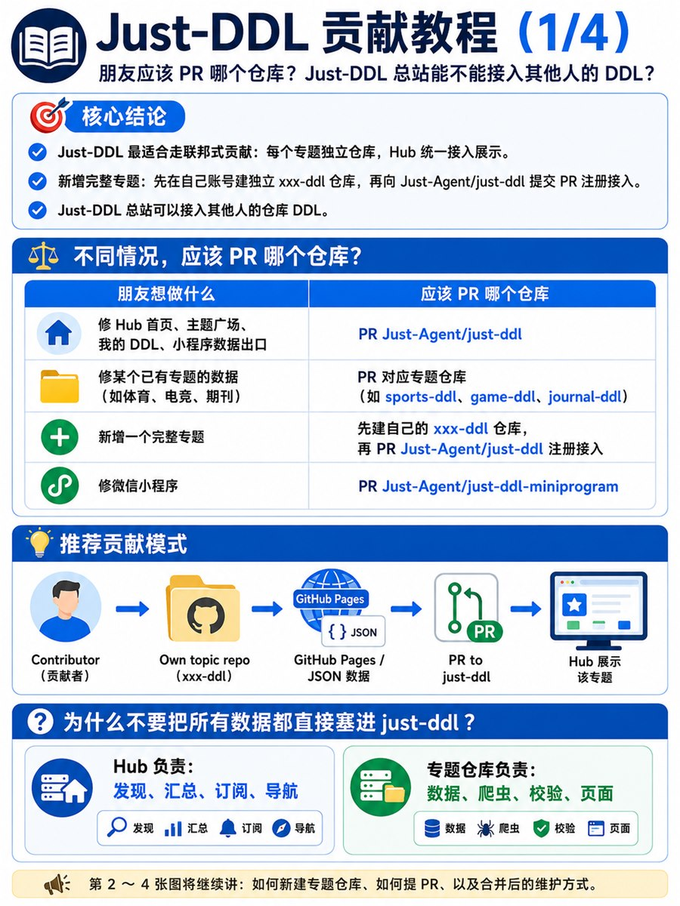
</p>

#### 2. 新建自己的 `xxx-ddl` 专题仓库

<p align="center">
  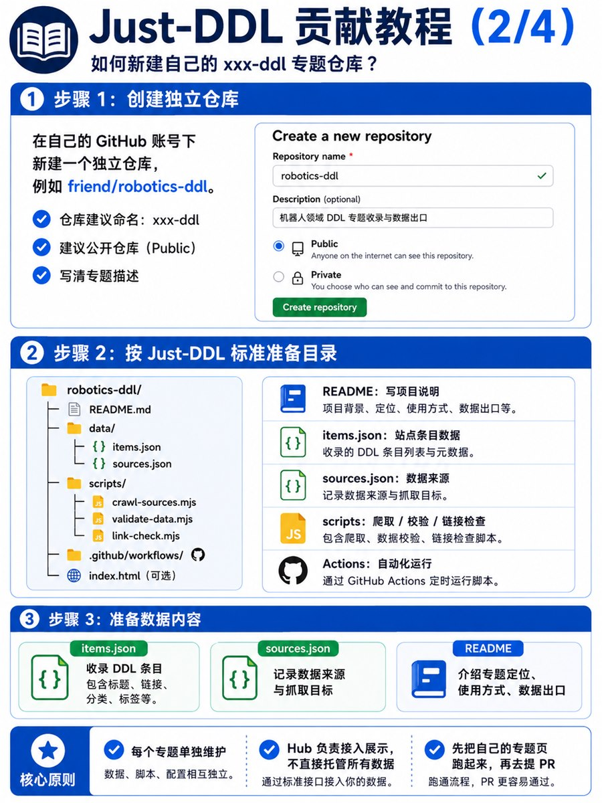
</p>

#### 3. 发布 Pages、校验数据，然后提交 Hub PR

<p align="center">
  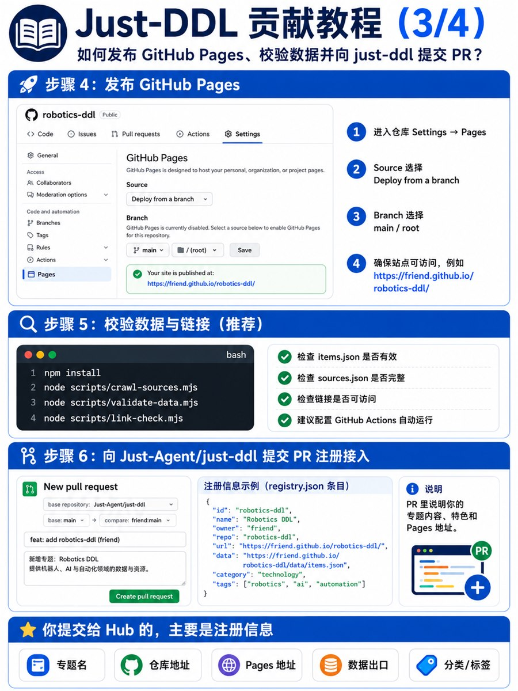
</p>

#### 4. 合并后继续维护专题仓库

<p align="center">
  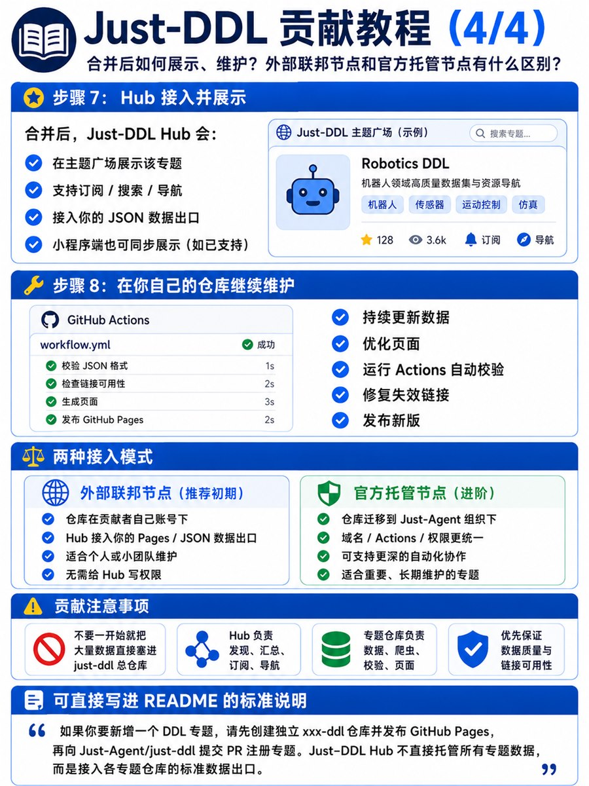
</p>

### 三种接入模式

外部联邦节点是默认推荐；fork 镜像适合备份、审核和过渡；官方托管适合长期稳定、愿意转移 ownership 的核心专题。

<p align="center">
  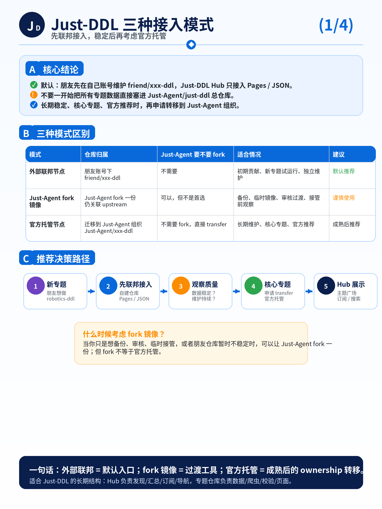
</p>

<p align="center">
  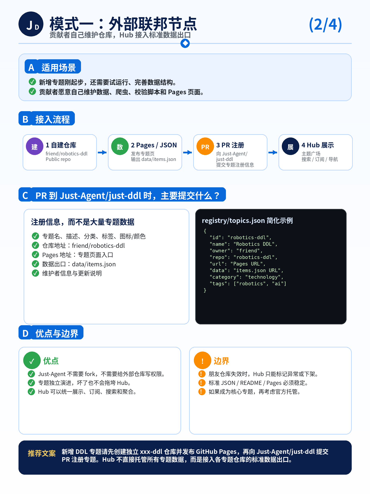
</p>

<p align="center">
  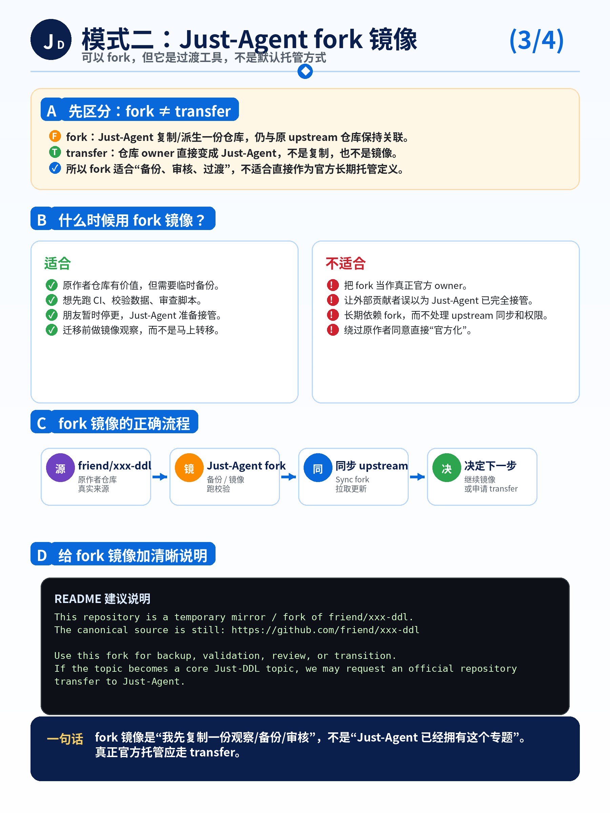
</p>

<p align="center">
  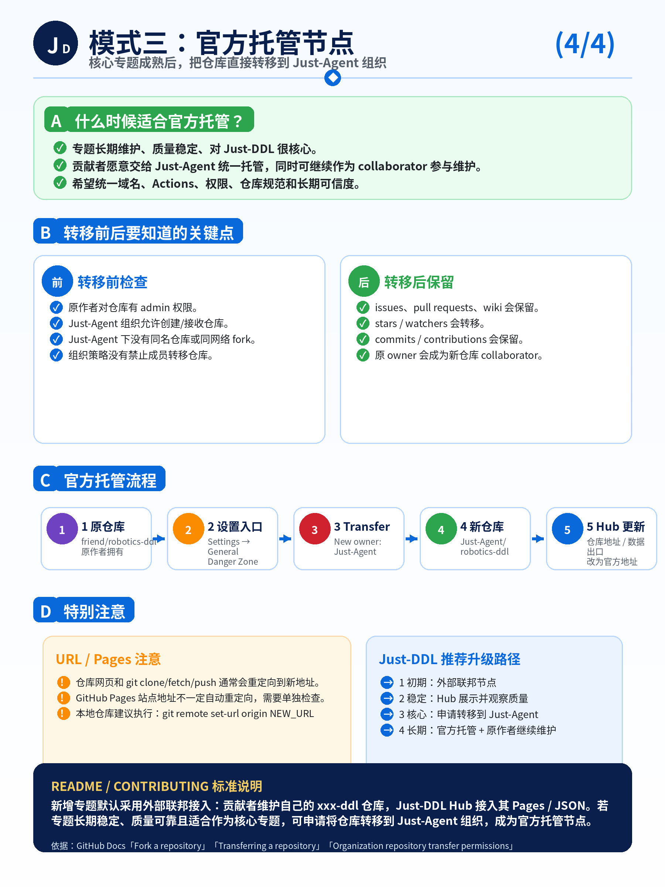
</p>

## License

当前仓库处于产品孵化阶段。正式开源协议会在发布稳定版本前补齐。


